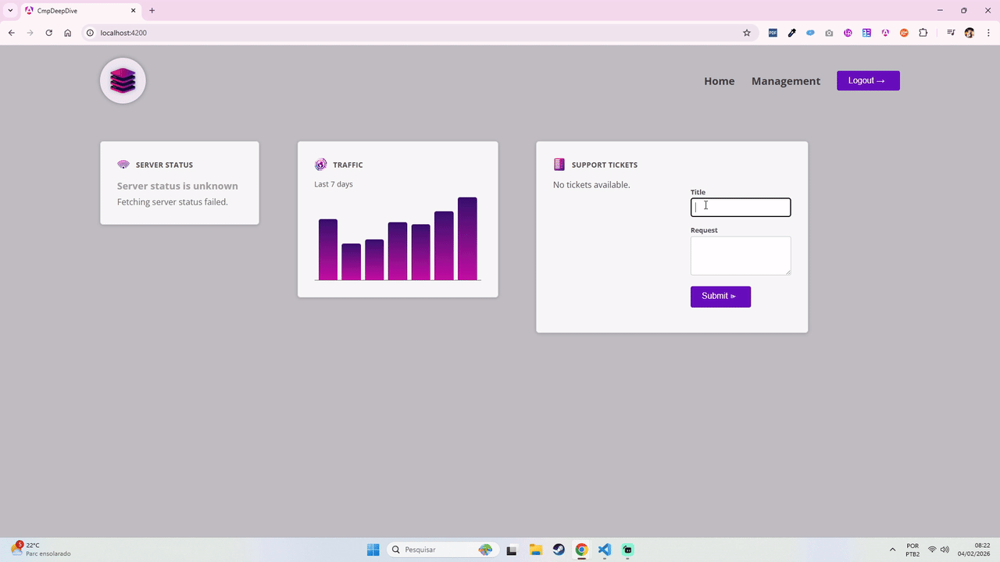

# Components & Templates — Deep Dive (Angular Study Project)

This repository contains a study project built while following the Udemy course:

**Master Angular (formerly "Angular 2") – The Complete Guide**  
https://www.udemy.com/course/the-complete-guide-to-angular-2/

## 🎬 Demo
Add a GIF/screenshot here (optional):


- or `src/assets/` if you prefer

## 🎯 Purpose
This project is a learning environment to practice **Angular components & templates** more deeply—focusing on **reusable UI patterns**, **content projection**, **lifecycle hooks**, and **modern Angular APIs**.

It is not meant for production. The goal is to experiment, break things, and learn.

## ✅ Topics Covered
### Components & Reusability
- Building reusable components (shared UI building blocks)
- Feature-based organization (`dashboard/`, `tickets/`, `shared/`)
- Component selectors (element selectors and **attribute selectors**)

### Templates & Content Projection
- `ng-content` basics
- Multiple `ng-content` slots using `select` (CSS selectors)
- Restricting projected content (e.g., allow only `input, textarea`)
- Understanding template variables (`#var`) and what they reference

### Styling & Host Element
- Component host element in the real DOM
- Styling the host with `:host`
- View encapsulation (`ViewEncapsulation.None`) and when to use it
- Adding host attributes via:
  - `host: { class: '...' }` (preferred)
  - `@HostBinding()` (legacy / backward compatibility)

### Component Lifecycle (Practical Usage)
- Why initialization work belongs in `ngOnInit` (not constructors)
- `OnInit` interface to prevent silent typos in lifecycle method names
- Cleanup patterns:
  - `ngOnDestroy` with `clearInterval`
  - `DestroyRef.onDestroy()` (Angular 16+)

### Template Access / Queries
- `@ViewChild()` to access template elements (e.g., form reset)
- `@ContentChild()` / `ContentChild()` to access projected content
- When to use:
  - `AfterViewInit` (ViewChild ready)
  - `AfterContentInit` (ContentChild ready)

### Modern Angular (v16+ / v17+ patterns)
- Signals (`signal`, `WritableSignal`) in component state
- `effect()` to react to signal changes in TypeScript
- Cleanup inside effects via `onCleanup()`
- (Optional/advanced) Render hooks:
  - `afterNextRender` (Angular 16+)
  - `afterRender` / **`afterEveryRender` (Angular 20+)**

## 🛠️ Tech Stack
- **Angular**: 18.x
- **TypeScript**
- Angular CLI
- npm

## ▶️ Getting Started
Install dependencies and run the dev server:

```bash
npm install
npm start
